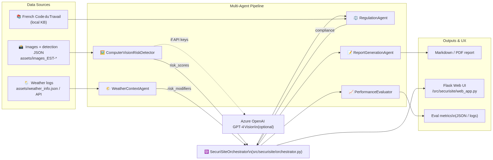

# SecuriSite‑IA  
_Construction‑Site Safety Intelligence powered by a multi‑agent, GPT‑4 Vision‑ready pipeline_

## 1. What is SecuriSite‑IA?
SecuriSite‑IA is a **multi‑agent system** that turns raw images and context data from a construction site into actionable safety insights, French labour‑code compliance checks, and beautifully formatted reports—all in a few seconds.

<p align="center">
  
</p>

Key capabilities
----------------
| Agent | Purpose | Tech Highlights |
|-------|---------|-----------------|
| **ComputerVisionRiskDetector** | Detects PPE absence, proximity risks, crane zones, container obstructions | GPT‑4 Vision\* or JSON fallback, OpenCV, PIL |
| **WeatherContextAgent** | Adds real‑time weather risk multipliers & recommendations | External API / local JSON, rules engine |
| **RegulationAgent** | Maps detected risks to _Code du Travail_ articles, rates compliance | Knowledge Base (French Regulation) |
| **ReportGenerationAgent** | Builds French‑language Markdown / PDF reports | Jinja2 templates |
| **PerformanceEvaluator** | Tracks detection accuracy, coverage, speed | Baseline vs. live metrics |

\*Vision is optional—when credentials are missing we seamlessly fall back to pure JSON analysis :contentReference[oaicite:10]{index=10}.

---

## 2. Directory layout (short version)

```text
.
├── src/
│   ├── main.py              # One‑shot full analysis entry‑point
│   ├── run_web_app.py       # Tablet‑friendly dashboard
│   ├── securisite/          # Core Python package
│   │   ├── agents/          # Risk, weather, regulation, report agents
│   │   ├── orchestrator.py  # Coordinates agents end‑to‑end
│   │   ├── evaluation/      # PerformanceEvaluator
│   │   └── templates/       # HTML + MD templates
│   └── tests …              # Data & agent/unit/system tests
├── assets/                  # Real dataset (June 10 → July 17 2025, 270 images)
├── requirements.txt
├── Dockerfile
└── .env.example             # Fill in your secrets
``` :contentReference[oaicite:11]{index=11}

---

## 3. Quick start

### 3.1 Local (Python ≥ 3.10)

```bash
git clone https://github.com/your‑org/securisite‑ia.git
cd securisite‑ia
python -m venv .venv && source .venv/bin/activate
pip install -r requirements.txt        # core + Flask UI :contentReference[oaicite:12]{index=12}
cp .env.example .env                   # then edit (see below)
python src/main.py                     # run a full sample analysis
python src/run_web_app.py              # open http://localhost:5000
